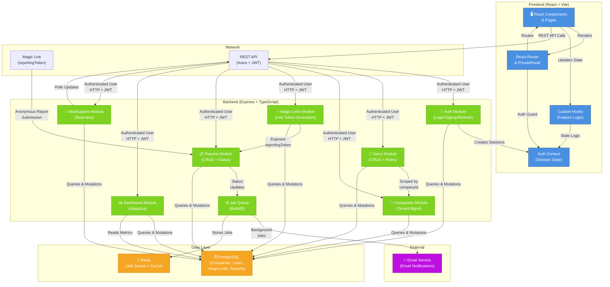

Anonymous Reporting Platform (main purpose of this project was testing the lightweight orchestration agents, posted Holland Burke at https://gist.github.com/burkeholland/0e68481f96e94bbb98134fa6efd00436 )

> **Simple Anonymous Reporting Platform** — A full-stack anonymous reporting platform where companies can generate unique magic links that allow employees to anonymously submit reports (concerns, feedback, issues) directly to management.

---

## AI-Assisted Development Workflow

This project was built leveraging an **AI agent workflow** with specialized roles:
(included in the project)
| Agent | Role |
|---|---|
| **Orchestrator** | Breaks down complex requests into tasks, coordinates parallel execution, and manages dependencies between phases |
| **Planner** | Creates implementation strategies, defines file assignments, and produces step-by-step technical plans |
| **Coder** | Implements logic, writes code, fixes bugs, and handles backend/frontend development |
| **Designer** | Creates UI/UX components, styling, and visual design decisions |

The orchestrator delegates tasks to specialist agents, parallelizing work on independent files while sequencing tasks that share dependencies. This multi-agent approach accelerates development while maintaining consistency across the codebase.

---

## Tech Stack

| Layer | Technology |
|---|---|
| **Backend** | Express 5, TypeScript 5.9, TypeORM 0.3, PostgreSQL |
| **Frontend** | React 19, Vite 7, MUI 7 (Material UI), React Router 7 |
| **Queue** | BullMQ + Redis (background job processing) |
| **Auth** | JWT (access + refresh tokens), HTTP-only cookies |
| **Testing** | Jest + pg-mem + Supertest (backend), Vitest + Testing Library (frontend) |

---

## High-Level System Diagram

(Must be viewed from the desktop as mermaid  diagrams do not load on github if you are reading this from a mobile device)



### Key Data Flows

**1. Authenticated User Flow (Admin/Manager)**
- User signs in via `/auth/sign-in` → JWT tokens issued (access in httpOnly cookie, refresh in localStorage)
- Access subsequent endpoints authenticated via JWT
- Dashboard, Reports, Users, and Magic Links modules all scoped by `companyId` for tenant isolation
- Refresh tokens automatically renewed before expiry

**2. Anonymous Report Submission Flow**
- External user receives magic link with embedded `reportingToken` (no authentication required)
- User submits report via public `/reports/submit` endpoint
- Report created with reference to the MagicLink and company
- Status changes trigger background jobs for notifications
- Managers notified via email when new reports arrive

- Report created with reference to the MagicLink and company
- New report submissions enqueue background jobs for email notifications to managers.
- Report status changes update the notifications UI (navbar) but do not enqueue background jobs.
- Managers notified via email when new reports arrive

**Code pointers**
- **Background job (enqueue on submission):** [backend/src/modules/reports/reports.service.ts](backend/src/modules/reports/reports.service.ts#L29-L66) — `submitReport()` calls `enqueueReportNotification(companyId, saved.id)` after saving a new report.
- **Status changes (no job enqueue):** [backend/src/modules/reports/reports.service.ts](backend/src/modules/reports/reports.service.ts#L105-L135) — `updateReportStatus()` writes a `ReportStatusHistory` entry and updates the `Report` status in the DB; it does not call the notification queue.
- **Notification queue & worker:** [backend/src/modules/notifications/notifications.service.ts](backend/src/modules/notifications/notifications.service.ts#L1-L20) and [backend/src/modules/notifications/notifications.worker.ts](backend/src/modules/notifications/notifications.worker.ts#L1-L40) — `enqueueReportNotification()` adds a `report-submitted` job to the `notificationEvents` queue which the worker processes to send emails.
- **Navbar / notifications UI:** [frontend/src/hooks/modules/useNotifications.ts](frontend/src/hooks/modules/useNotifications.ts#L1-L40) and [frontend/src/views/acp/index.tsx](frontend/src/views/acp/index.tsx#L36-L42) — the hook polls `getNotifications()` and exposes `unread`, which the ACP layout Badge consumes to display the new-report count in the navbar.

**3. Background Job Processing**
- BullMQ + Redis handle async tasks (email notifications, report status updates, etc.)
- Decouples long-running operations from HTTP requests
- Ensures reliable job processing and retry logic

---

## Project Architecture

### Monorepo Structure

```
root/
├── backend/          # Express 5 + TypeScript + TypeORM + PostgreSQL
├── frontend/         # React 19 + Vite + MUI + React Router 7
└── readme.md
```

The backend and frontend are **independent applications** with separate `package.json` files — there are no shared packages. They were included in the same repository to facilitate the evaluation of the challenge. (In a real scenario they would be separated into different repositories to facilitate/simplify CI/CD pipes)

### Domain Model

```
Company
├── Users (admin / manager roles)
├── MagicLinks (each exposes a unique reportingToken)
└── Reports (submitted anonymously via magic link)
    └── StatusHistory (new → in_review → resolved / rejected)
```

### Backend Module Pattern

Each feature lives under `src/modules/<name>/` and follows a consistent layout:

```
src/modules/users/
├── users.entity.ts       # TypeORM entity (decorator-based, column definitions)
├── users.routes.ts       # Express Router — wires middleware + handler functions
├── users.handler.ts      # Request/response layer — reads req, calls service, writes res
├── users.service.ts      # Business logic + authorization
├── users.dtos.ts         # Data Transfer Objects / validation
└── __tests__/            # Unit and integration tests
    ├── users.handler.unit.test.ts
    └── users.service.integration.test.ts
```

This separation ensures a clear boundary between HTTP concerns (handler), business rules (service), and data modeling (entity).

### Frontend Structure

```
frontend/src/
├── api/            # Axios instance + endpoint functions (*.api.ts)
├── components/     # Reusable UI components
├── contexts/       # React contexts (AuthContext)
├── hooks/          # Custom hooks (useLocalStorage, useIsReportsRoute)
│   └── modules/    # Feature hooks (useAuth, useDashboard, useMagicLinks, useNotifications, useReports, useSearch, useSettings, useUsers)
├── router/         # React Router config + PrivateRoute guard
├── utils/          # Utility functions (formatDate, extractErrorMessage)
└── views/
    ├── acp/        # Admin Control Panel (reports, users, magic links, dashboard, settings)
    ├── auth/       # Sign-in / Sign-up pages
    └── report/     # Anonymous report submission (public, via magic link token)
```

---

## Security Implementation

Security was a key consideration throughout this project as required in the challenge PDF. Below are the measures implemented:

### 1. Hardened JWT Authentication (Beyond Typical Implementation)

The authentication system uses a **dual-token strategy** with an additional binding mechanism:

**Typical implementation:** Access token stored in an HTTP-only cookie + refresh token. The HTTP-only flag prevents JavaScript from reading the access token, mitigating XSS. However, this alone doesn't fully prevent session hijacking — an XSS attacker could still invoke the refresh endpoint to obtain new tokens.

**This implementation adds access token binding:**

1. When a token pair is generated, the **refresh token contains an MD5 hash of the access token** (`atHash` claim).
2. When a client requests a token refresh, the server requires **both** the refresh token (from the request body) **and** the access token (from the HTTP-only cookie).
3. The server verifies that `md5(access_token_cookie) === refresh_token.atHash`.

Used MD5 to hash to minimize memory and bandwidth usage on each request; otherwise SHA-256 could have been used since the hash is only a parameter within the refresh_token

**Why this matters:** Even if an attacker exploits an XSS vulnerability and obtains the refresh token (stored in localStorage), they **cannot hijack the session** because they lack the access token — which is stored in an HTTP-only cookie and is inaccessible to JavaScript (on modern browsers and Chromium-based variants). The refresh endpoint will reject any request where the access token hash doesn't match.

```
┌─────────────┐     httpOnly cookie      ┌─────────────┐
│   Browser    │ ───── access_token ────→ │   Server    │
│              │     request body         │             │
│              │ ─── refresh_token ─────→ │  Verifies:  │
│              │                          │  md5(AT) == │
│              │                          │  RT.atHash  │
└─────────────┘                          └─────────────┘
```

Additional cookie hardening:
- `httpOnly: true` — prevents JavaScript access
- `secure: true` in production — HTTPS only
- `sameSite: 'strict'` — prevents CSRF

### 2. Tenant Isolation via companyId Scoping

Every authenticated service call uses `getAuthenticatedUserData().companyId` to scope all database queries. This guarantees **complete tenant isolation** — users can never access, modify, or delete data belonging to another company.

```typescript
// Example: every report query is scoped to the authenticated user's company

//inside magiclinks.service.ts

//list by company:

export async function listByCompany(companyId: string, offset: number = 0, limit: number = 25): Promise<{ data: MagicLink[]; total: number; hasMore: boolean }> {
  const repo = getAppDataSource().getRepository(MagicLink)
  const [items, total] = await repo.findAndCount({
    where: { companyId },
    relations: ['createdBy'],
    order: { createdAt: 'DESC' },
    skip: offset,
    take: limit,
  })
  return { data: items, total, hasMore: offset + items.length < total }
}
```

This pattern is consistently applied across all modules: reports, users, magic links, dashboard, and notifications.

### 3. UUID Primary Keys

All entity IDs are generated as **UUIDv4** values, preventing sequential ID enumeration attacks (also known as "ID guessing" or IDOR attacks). An attacker cannot predict or brute-force valid resource IDs.

### 4. Parameterized Queries (SQL Injection Prevention)

TypeORM is used for all database interactions. All queries are **parameterized by default** — user input is never interpolated into SQL strings. This provides a foundational safeguard against SQL injection attacks.

### 5. Password Security

Passwords are hashed using Node.js built-in `crypto.scrypt` with a random salt. Comparison uses `crypto.timingSafeEqual` to prevent timing attacks. Stored format: `"<salt>:<hex-derivedKey>"`.

### 6. Role-Based Access Control

Middleware guards enforce role requirements at the route level:
- `jwtGuard` — verifies authentication
- `ensureAdmin` — requires `admin` role
- `ensureManager` — requires `manager` or `admin` role

### 7. Rate Limiting

An in-memory IP-based rate limiter is applied to the report submission endpoint (1 request per minute) to prevent abuse of the anonymous submission form.

---

## Redis & Background Processing

### BullMQ Notification Queue

Report notifications (e.g., email alerts to managers) are processed **asynchronously via BullMQ** rather than during the HTTP request lifecycle. This ensures report submissions remain fast and don't block on external I/O (SMTP delivery).

**Flow:**
1. Report submitted → `enqueueReportNotification()` adds a job to the BullMQ queue
2. A background worker picks up the job (concurrency: 2)
3. **Anti-spam deduplication**: Redis TTL key (`notification:dedup:{companyId}`, 5-minute window) prevents duplicate emails for rapid consecutive submissions
4. Worker fetches all manager-role users for the company and sends a BCC email via Nodemailer

Jobs are configured with 3 retry attempts and exponential backoff (5s base).

### JWT Invalidation (Sign Out All Devices)

Token invalidation uses a **dual-layer approach** for performance:

1. **Redis (persistence):** `token:invalidated:{userId} → timestamp` — persists across server restarts
2. **In-memory Map (speed):** loaded from Redis on application startup, checked on every request with zero I/O latency

When a user triggers "Sign Out All Devices", the current timestamp is recorded. Any JWT with an `iat` (issued-at) before that timestamp is rejected by `jwtGuard`.

**Memory footprint:** The in-memory map stores `UUIDv4 (16 bytes) → timestamp (8 bytes) = 24 bytes` per entry. For **1 million users**, this consumes approximately **~24 MB** of memory — a negligible cost for eliminating Redis round-trips on every authenticated request. (Only relevant if the Redis node is placed in another machine / datacenter)

---

## Testing

### Backend Tests (Jest + pg-mem + Supertest)

Tests are split by convention:
- **`*.unit.test.ts`** — Isolated unit tests (mocked dependencies)
- **`*.integration.test.ts`** — Full integration tests using an **in-memory PostgreSQL** instance via `pg-mem`, with `supertest` for HTTP assertions

The test `DataSource` is injected into `createApp(dataSource)`, fully isolating tests from the real database.

**185 tests across 19 suites — all passing**

| Module | Statements | Branches | Functions | Lines |
|---|---|---|---|---|
| **All files** | **82.41%** | **54.91%** | **80.50%** | **83.00%** |
| auth | 89.47% | 64.51% | 92.30% | 89.47% |
| companies | 100% | 100% | 100% | 100% |
| dashboard | 56.00% | 100% | 0% | 56.00% |
| magiclinks | 72.82% | 46.15% | 66.66% | 72.22% |
| notifications | 100% | 100% | 100% | 100% |
| reports | 81.64% | 44.18% | 66.66% | 82.99% |
| users | 64.48% | 23.52% | 53.84% | 66.09% |
| shared/auth | 100% | 100% | 100% | 100% |
| shared/database | 100% | 100% | 100% | 100% |
| shared/errors | 100% | 100% | 100% | 100% |
| shared/middleware | 96.87% | 90.62% | 100% | 100% |
| shared/utils | 87.87% | 88.46% | 100% | 87.50% |

```bash
cd backend
npm test              # Run all tests
npm run test:unit     # Unit tests only
npm run test:integration  # Integration tests only
npm test -- --coverage    # With coverage report
```

### Frontend Tests (Vitest + Testing Library)

Frontend tests include **unit tests** (`*.unit.test.ts` / `*.unit.test.tsx`) for hooks, utilities, and contexts, plus **component tests** (`*.test.tsx`) for view pages, using `@testing-library/react` for rendering and `axios-mock-adapter` for API mocking.

**109 tests across 17 suites — all passing**

| Module | Statements | Branches | Functions | Lines |
|---|---|---|---|---|
| **All files** | **72.66%** | **69.79%** | **56.84%** | **73.06%** |
| api | 35.18% | 52.94% | 19.23% | 35.18% |
| components | 100% | 60.00% | 100% | 100% |
| contexts (AuthContext) | 91.89% | 85.71% | 81.81% | 91.17% |
| hooks | 89.47% | 100% | 100% | 89.47% |
| hooks/modules | 100% | 86.66% | 100% | 100% |
| router (PrivateRoute) | 100% | 100% | 100% | 100% |
| utils | 94.73% | 93.75% | 100% | 93.75% |
| views/acp/dashboard | 100% | 100% | 100% | 100% |
| views/acp/magiclinks | 60.86% | 55.55% | 36.84% | 65.85% |
| views/acp/reports | 57.89% | 50.00% | 37.50% | 60.00% |
| views/acp/settings | 28.00% | 55.00% | 20.00% | 28.00% |
| views/acp/users | 68.85% | 75.00% | 45.00% | 69.49% |
| views/auth/sign-in | 77.77% | 50.00% | 71.42% | 76.47% |
| views/auth/sign-up | 100% | 87.50% | 100% | 100% |
| views/report | 78.12% | 72.72% | 87.50% | 80.64% |

```bash
cd frontend
npm test              # Run all tests
npm run test:watch    # Watch mode
npm run test:coverage # With coverage report
```

### E2E Tests

End-to-end tests (e.g., Selenium/WebDriver/Playwright) were not implemented for this project as it would be beyond the scope of the challenge. In a production application, E2E tests would be valuable for critical user flows such as the sign-up → create magic link → submit report pipeline.

---

## Local Development Setup

### Prerequisites

- **Node.js** (v18+ recommended)
- **PostgreSQL** (v14+)
- **Redis** (v6+)

### 1. Create the PostgreSQL Database

```bash
sudo -u postgres psql
```

```sql
CREATE USER appuser WITH PASSWORD 'app_pass';
CREATE DATABASE appdb OWNER appuser;
GRANT ALL PRIVILEGES ON DATABASE appdb TO appuser;
```


### 2. Backend Setup

```bash
cd backend
npm install
```

Rename `.envExample` to `.env` and configure it:

```env
# Environment
NODE_ENV=dev
SHOW_UNHANDLED_ERRORS_IN_CONSOLE=false

# CORS
CORS_ALLOWED_ORIGINS=http://localhost:5173
CORS_ALLOW_CREDENTIALS=true

# PostgreSQL
POSTGRES_HOST=localhost
POSTGRES_PORT=5432
POSTGRES_USER=appuser
POSTGRES_PASSWORD=app_pass
POSTGRES_DB=appdb
PORT=3000

# JWT
JWT_ACCESS_SECRET=mySecret
JWT_EXPIRATION=3600
JWT_REFRESH_SECRET=myRefreshSecret
JWT_REFRESH_EXPIRATION=604800

# Redis
REDIS_HOST=localhost
REDIS_PORT=6379
REDIS_PASSWORD=

# Email (optional — disabled by default)
ENABLE_SMTP_EMAILS=false
SMTP_HOST=smtp.example.com
SMTP_PORT=587
SMTP_SECURE=false
SMTP_USER=your-username
SMTP_PASS=your-password
SMTP_FROM=noreply@yourapp.com
```

| Variable | Default | Description |
|---|---|---|
| `NODE_ENV` | `dev` | `dev` or `production` — controls cookie `secure` flag and error verbosity |
| `POSTGRES_HOST` | `localhost` | PostgreSQL hostname |
| `POSTGRES_PORT` | `5432` | PostgreSQL port |
| `POSTGRES_USER` | — | PostgreSQL username |
| `POSTGRES_PASSWORD` | — | PostgreSQL password |
| `POSTGRES_DB` | — | PostgreSQL database name |
| `PORT` | `3000` | HTTP server port |
| `JWT_ACCESS_SECRET` | — | Secret for signing JWT access tokens |
| `JWT_EXPIRATION` | `3600` | Access token lifetime in seconds (default: 1 hour) |
| `JWT_REFRESH_SECRET` | — | Secret for signing JWT refresh tokens |
| `JWT_REFRESH_EXPIRATION` | `604800` | Refresh token lifetime in seconds (default: 7 days) |
| `CORS_ALLOWED_ORIGINS` | — | Comma-separated allowed origins |
| `REDIS_HOST` | `localhost` | Redis hostname |
| `REDIS_PORT` | `6379` | Redis port |
| `REDIS_PASSWORD` | _(empty)_ | Redis AUTH password (optional) |
| `ENABLE_SMTP_EMAILS` | `false` | Enable email sending via SMTP |

### 3. Run Database Migrations

```bash
cd backend
npx typeorm-ts-node-commonjs migration:run -d src/shared/database/data-source.ts
```

This creates all required tables and indexes. TypeORM `synchronize` is **disabled** — the schema is managed entirely through migrations.

### 4. Start the Backend

```bash
cd backend
npm run dev
```

The server starts on `http://localhost:3000`.

### 5. Frontend Setup

```bash
cd frontend
npm install
```

Rename `.envExample` to `.env`:

```env
VITE_BASE_LINK=http://localhost:5173
VITE_PROACTIVE_REFRESH_TOKENS_BEFORE_EXPIRATION_MINUTES=10
```

| Variable | Default | Description |
|---|---|---|
| `VITE_BASE_LINK` | `http://localhost:5173` | Base URL for the frontend application |
| `VITE_PROACTIVE_REFRESH_TOKENS_BEFORE_EXPIRATION_MINUTES` | `10` | Minutes before token expiry to proactively refresh the session (also refreshes automatically on token expiration but this avoids unexpected retries |

### 6. Start the Frontend

```bash
cd frontend
npm run dev
```

The application opens on `http://localhost:5173`.

---

## Database Migrations

TypeORM migrations are the source of truth for the database schema.

```bash
# Generate a new migration after modifying entities
cd backend
npx typeorm-ts-node-commonjs migration:generate -d src/shared/database/data-source.ts src/migrations/<MigrationName (leave empty for an automatic naming convention timestamp based)>

# Run pending migrations
npx typeorm-ts-node-commonjs migration:run -d src/shared/database/data-source.ts
```

---

## Available Commands

### Backend

| Command | Description |
|---|---|
| `npm run dev` | Start development server with hot reload |
| `npm run build` | Compile TypeScript to JavaScript |
| `npm test` | Run all tests |
| `npm run test:unit` | Run unit tests only |
| `npm run test:integration` | Run integration tests only |

### Frontend

| Command | Description |
|---|---|
| `npm run dev` | Start Vite development server |
| `npm run build` | Production build |
| `npm test` | Run all tests |
| `npm run test:watch` | Run tests in watch mode |
| `npm run test:coverage` | Run tests with coverage report |

---

## To Improve

- **CAPTCHA** on report submission and authentication forms to prevent automated abuse
- **Global rate limiting** across all endpoints (currently only applied to report submission)

## Untested

- **Email sending** (SMTP integration) — disabled by default via `ENABLE_SMTP_EMAILS=false`; the notification queue and worker logic are tested, but actual email delivery via Nodemailer is not covered in automated tests
